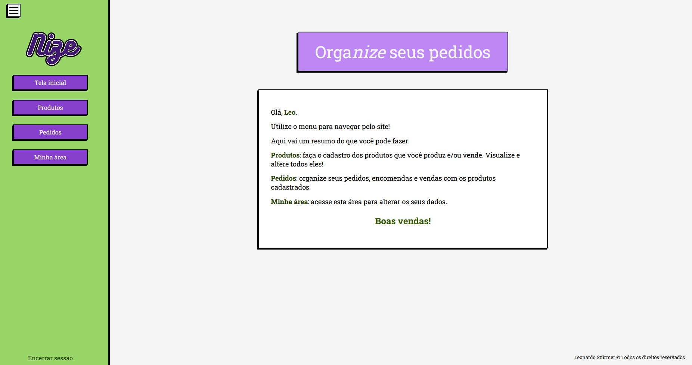

# Sistema para vendedores autônomos 

O Nize é um sistema desenvolvido como Projeto Integrador do curso Técnico em Desenvolvimento de Sistemas do Senac RS.

Pensado para vendedores autônomos, a plataforma permite que usuários registrem seus produtos e pedidos. Assim, eles podem gerenciar o seu estoque, suas encomendas e suas vendas.

O projeto segue em andamento, com previsão de conclusão para setembro/2026.

