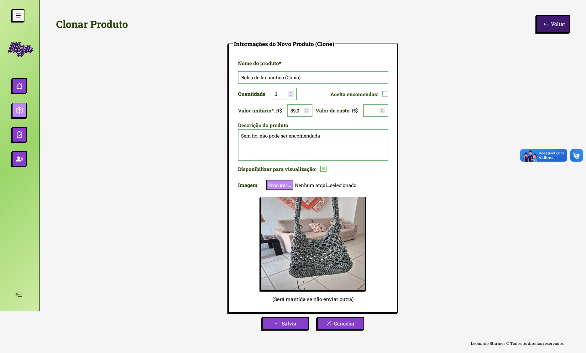
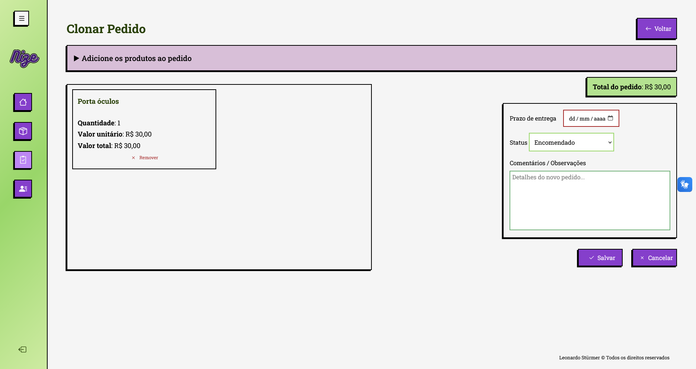

# Sistema para vendedores autônomos 

O Nize é um sistema desenvolvido como Projeto Integrador do curso Técnico em Desenvolvimento de Sistemas do Senac RS. Pensado para vendedores autônomos, a plataforma permite que usuários registrem seus produtos e pedidos. Assim, eles podem gerenciar o seu estoque, suas encomendas e suas vendas.

O projeto teve início em 2024, ganhando inicialmente [uma versão em Python]([url](https://github.com/leosturmer/Nize_Python_Desktop)). Atualmente, o projeto está em sua fase final, onde foi desenvolvido em PHP e HTML, utilizando banco de dados SQLite, e com a interface gráfica construída com CSS e JavaScript.

No CRUD, o sistema possibilita o cadastro de novos usuários, que podem registrar os seus produtos e pedidos, bem como gerenciar os dados de sua conta. Os usuários também podem optar por abrir a visualização pública de produtos da loja e, ao fazer isso, enviar um link de uma "loja virtual" para os clientes. Com este link, os clientes podem realizar os próprios pedidos, que são salvos no banco de dados e redirecionados para o WhatsApp.

## Execução do projeto

Desde a execução em Python até a versão web, o projeto foi desenvolvido seguindo metodologia ágil incremental, já que o projeto sofreu mudanças constantes durante a execução. O projeto também visou a utilização de MVC, separando os arquivos em diretórios específicos e, junto a isso, a conexão com o banco foi feita através de DAO (Data Access Object) para facilitar a manutenção do sistema com o banco.

A versão web foi feita majoritariamente através de PHP, utilizando HTML e o CSS para estilização. Nesta versão, foi possível adicionar novas funcionalidades, como a criação de uma loja para visualização e para que clientes façam pedidos diretamente pelo link da loja. Para o futuro, quando o site for devidamente hospedado, será necessária a implementação de gerenciamento .htaccess para mudar os links que aparecem no navegador do usuário.

Algumas funcionalidades foram implementadas com JavaScript, onde foi utilizada a IA do Gemini para auxiliar na execução. Além do JavaScript, a inteligência artificial também foi utilizada para a parte de pedidos do controller e DAO, onde o sistema exigiu maior complexidade para pegar o número de produtos e pedidos para salvar no banco.

## Telas do sistema

O projeto segue em desenvolvimento até setembro de 2026. Abaixo, as capturas de tela do sistema:

### Index

### Cadastro de usuário

### Login

### Dashboard Administrador

### Tela inicial

### Visualização de produtos

### Cadastro de produtos

### Alteração de produtos

### Clonar produto

### Visualização de pedidos

### Cadastro de pedidos

### Alteração de pedido

### Alteração de pedido cancelado

### Alteração de pedido vendido

### Clonar pedido

### Área do usuário

### Alteração de dados de cadastro

### Visualização pública de loja

### Tela de erro

